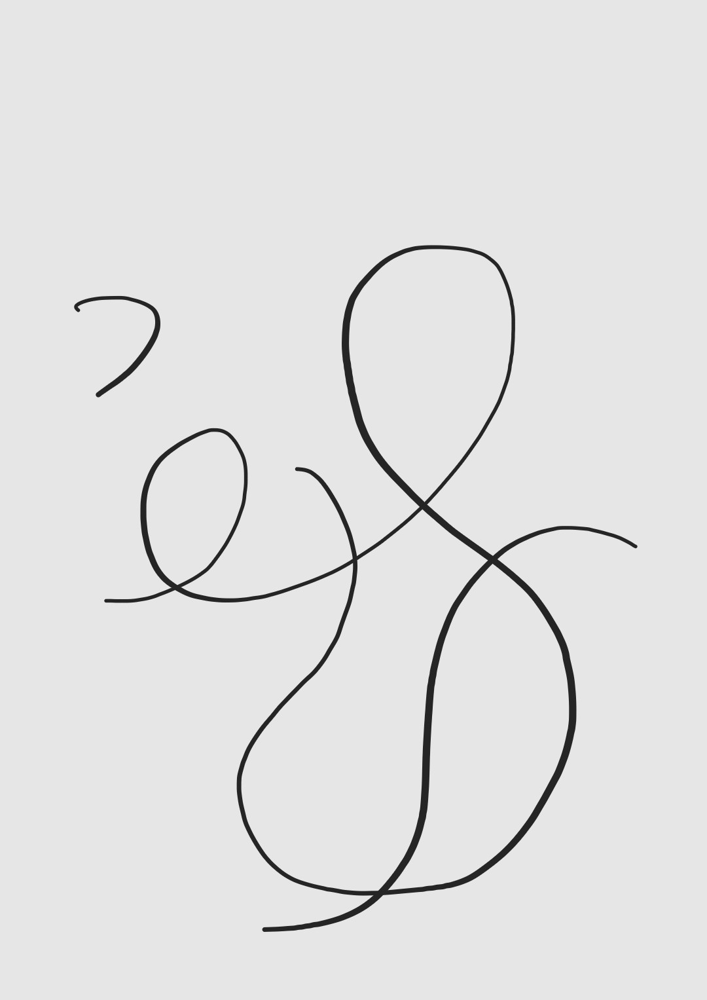

# schmorgoofol

The schmorgoofol is supposed to represent the missing phoneme glyph in the english language for the middle syllable in casual, some have suggested using zsjh for this phoneme, but i think we shoudl just make a new glpyh, which i ahve, the schmogroofol

Schmorgoofol is life, schmorgoofol is kind, schmorgoofol is all

enjoy

# Examples of schmorgoofol useage throughout the internet

[Hisaya rosier using the schmorgoofol glyph to write the schmorgoofol at the start of schmorgoofol](https://bsky.app/profile/hisayarosier.bsky.social/post/3lrfqd2xuhc2c)